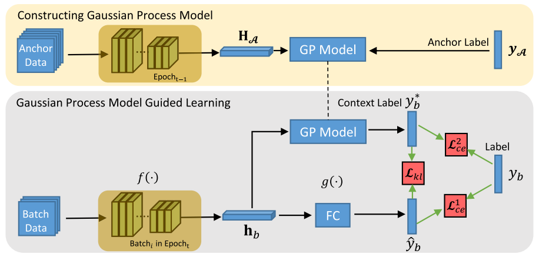

# GPGL
epoch-evolving Gaussian process guided learning



## Citing
```
@ARTICLE{9779793,
author={Jiabao Cui and Xuewei Li and Bin Li and Hanbin Zhao and Bourahla Omar and Xi Li},
journal={IEEE Transactions on Neural Networks and Learning Systems},
title={Epoch-Evolving Gaussian Process Guided Learning for Classification},
year={2022},
volume={},
number={},
pages={1-12},
doi={10.1109/TNNLS.2022.3174207}}
```
## Dependencies

The project is built to work using [MindSpore](https://www.mindspore.cn/) and [MindSpore Vision](https://www.mindspore.cn/vision/docs/zh-CN/r0.1/mindvision_install.html).

# Train and Test
## on Cifar10 Dataset
Open folder `move_cifar10_ms` and run `ms1_new.py` script.

Generated files:
* `train_err_2GP_err_32.txt` records `AVG_TRAIN_LOSS3` of each epoch.
* `train_err_2GP_loss_32.txt` records `AVG_Top1_error3` of each epoch.
* `test_err_2GP_err_32.txt` records `OUT_TEST_Top1_error3` every 200 steps.
* `test_err_2GP_loss1_32.txt` records test loss every 200 steps.

## on Cifar100 Dataset
Open folder `move_cifar100_ms` and run `ms_top5_test.py` script.

Output:
```
train_batch_total 391
test_batch_total 79
val_batch_total 100
lr= 0.1

Epoch: 0
build_val_time:  5.165887355804443

Test:  0 i_num:  0
OUT_TEST_Top1_error3:  0.99011075

Test:  0 i_num:  200
OUT_TEST_Top1_error3:  0.93047863
-------------------
AVG_TRAIN_LOSS3:  1.9875456
AVG_Top1_error3:  0.46451208
this_train_epoch_time:  83.14549994468689
Saving..
this_epoch:  83.15923070907593
total:  83.1623797416687 


lr= 0.1

Epoch: 1
build_val_time:  2.8037099838256836
...
```

Generated files (see `move_cifar100_ms/logs/`):
* `train_err_2GP_err_32.txt` records `AVG_TRAIN_LOSS3` of each epoch.
* `train_err_2GP_loss_32.txt` records `AVG_Top1_error3` of each epoch.
* `test_err_2GP_err_32.txt` records `OUT_TEST_Top1_error3` every 200 steps.
* `test_err_2GP_loss1_32.txt` records test loss every 200 steps.

# Checkpoints
See `move_cifar10_ms/checkpoint/cifar10_32/` or `move_cifar100_ms/checkpoint/5/`.
For Cifar10, `ckpt_2_155.ckpt` performs best; for Cifar100, `ckpt_top5_res20_102.ckpt` performs best.
